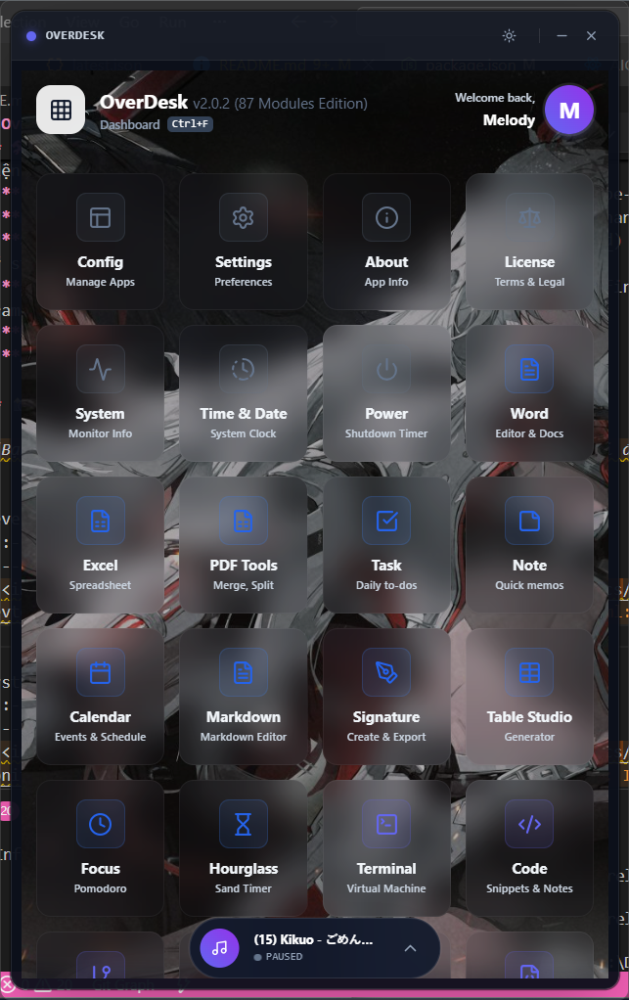
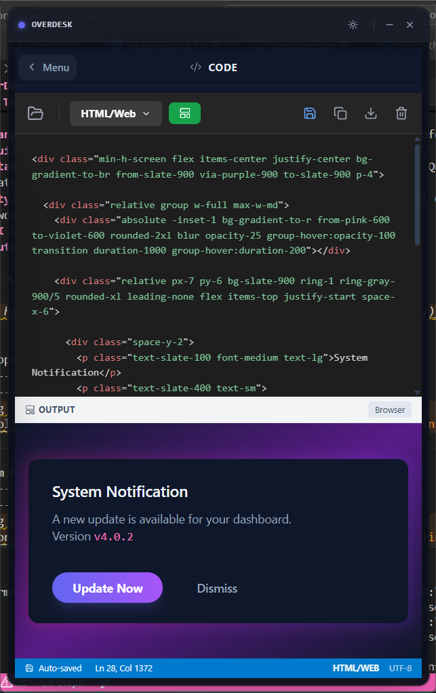
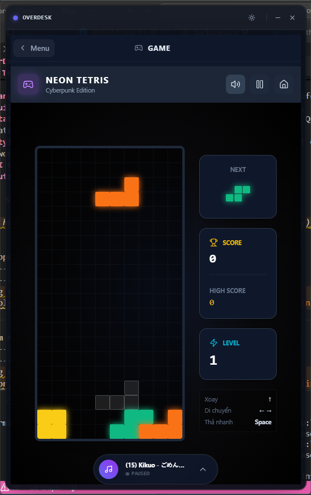
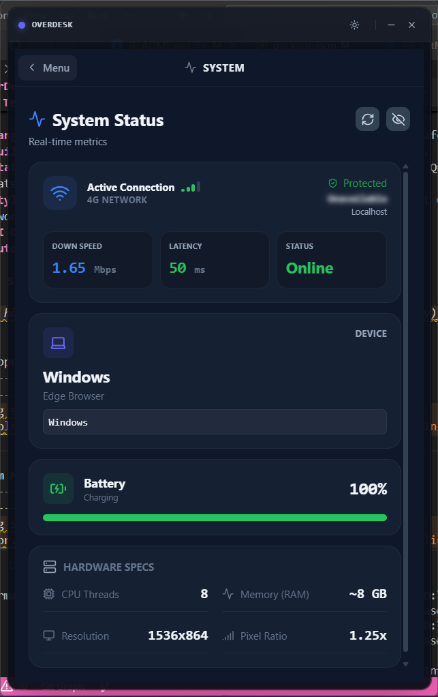

<div align="center">

  

# OverDesk

**Your Ultimate Productivity Companion**

  <p>
    Một hệ điều hành thu nhỏ dành cho Developer & Creator.<br/>
    Tối ưu hóa công việc, giải trí và quản lý cuộc sống trong một ứng dụng duy nhất.
  </p>

  <p>
    
    
    
    
    
    
  </p>

[Feature](#-features) • [Tech Stack](#-tech-stack) • [Installation](#-installation) • [Download](#-download)

</div>

---

## 📖 Introduction

**OverDesk** không chỉ là một Dashboard, nó là một "Super App" được xây dựng trên nền tảng **Tauri v2** mạnh mẽ và siêu nhẹ. Dự án hướng tới việc loại bỏ sự phân mảnh khi phải mở quá nhiều công cụ rời rạc (Postman, Calculator, Note, Browser, Terminal...) bằng cách tích hợp tất cả vào một giao diện thống nhất, đẹp mắt và hiệu suất cao.

## ✨ Features

OverDesk sở hữu thư viện module khổng lồ (+85 Modules) phục vụ mọi nhu cầu:

### 🚀 For Developers

| Module       | Description                                                  |
| :----------- | :----------------------------------------------------------- |
| **Terminal** | Máy ảo Terminal tích hợp ngay trên Dashboard.                |
| **DevTools** | JSON Formatter, Regex Tester, Base64 Decoder, JWT Inspector. |
| **Git Hub**  | Quản lý Git, xem commit và nhánh trực quan.                  |
| **Database** | Local SQL Database & ER Diagram Visualizer.                  |
| **DevOps**   | Docker Manager & Cron Job Generator.                         |

### 🎨 For Designers & Creators

| Module           | Description                                               |
| :--------------- | :-------------------------------------------------------- |
| **UI Factory**   | Công cụ thiết kế giao diện và export code React/Tailwind. |
| **Color & Type** | Color Picker, Palette Generator, Typography Scale.        |
| **Media Studio** | Screen Recorder, Camera Photo Booth, Image Compressor.    |
| **Icon Picker**  | Thư viện Lucide Icons tích hợp sẵn.                       |

### ✅ Productivity & Office

| Module           | Description                                          |
| :--------------- | :--------------------------------------------------- |
| **Workspace**    | Kanban Task, Notes, Calendar, Pomodoro Timer.        |
| **Office Suite** | Word Editor, Excel Spreadsheet, PDF Tools.           |
| **Utilities**    | Calculator, Unit Converter, Translate, QR Generator. |

### 🎮 Entertainment & Life

- **Gaming:** Tích hợp Plants vs Zombies, Tetris, RPG Quest, Tower Defense.
- **Media:** Music Player (Lofi/Local), Speed Reading.
- **Finance:** Crypto Portfolio, Budget Tracker, Loan Simulator.
- **System:** Live Monitor (CPU/RAM), Network Speedtest, Battery Health.

## 🛠 Tech Stack

Dự án được xây dựng dựa trên những công nghệ web hiện đại nhất để đảm bảo hiệu suất (Performance) và trải nghiệm người dùng (UX).

- **Core:** [Rust](https://www.rust-lang.org/) (Tauri v2) - Backend siêu nhẹ, bảo mật.
- **Frontend:** [React 18](https://reactjs.org/) - Library xây dựng giao diện.
- **Language:** [TypeScript](https://www.typescriptlang.org/) - Type-safety.
- **Build Tool:** [Vite](https://vitejs.dev/) - Tốc độ build cực nhanh.
- **State Management:** [Zustand](https://github.com/pmndrs/zustand) - Quản lý state đơn giản, mạnh mẽ.
- **Styling:** [Tailwind CSS](https://tailwindcss.com/) - Utility-first CSS framework.
- **UI Components:** Radix UI, Lucide Icons.
- **Auto Update:** Tauri Updater Plugin (OTA Updates).

## 📸 Screenshots

|                  Dashboard Home                   |                      Developer Tools                      |
| :-----------------------------------------------: | :-------------------------------------------------------: |
|  |  |

|                    Gaming Mode                    |                     System Monitor                      |
| :-----------------------------------------------: | :-----------------------------------------------------: |
|  |  |

## ⚡ Installation

Yêu cầu máy tính đã cài đặt:

- [Node.js](https://nodejs.org/) (v18+)
- [Rust](https://www.rust-lang.org/tools/install) (cargo)

1. **Clone repository**

   ```bash
   git clone [https://github.com/melody16032004/overdesk.git](https://github.com/melody16032004/overdesk.git)
   cd overdesk
   ```

2. **Cài đặt dependencies**

   ```bash
   npm install
   ```

3. **Chạy chế độ Development**

   ```bash
   npm run tauri dev
   ```

4. **Build bản Production**

   ```bash
   npm run tauri build
   ```

## 📦 Download

Tải xuống phiên bản mới nhất cho Windows, macOS hoặc Linux tại trang [Releases](https://github.com/melody16032004/overdesk/releases).

Ứng dụng hỗ trợ **Tự động cập nhật (Auto-Update)**. Bạn sẽ nhận được thông báo ngay khi có phiên bản mới.

## 🤝 Contributing

Mọi đóng góp đều được hoan nghênh! Nếu bạn muốn thêm module mới hoặc sửa lỗi:

1. Fork dự án.
2. Tạo nhánh tính năng (`git checkout -b feature/AmazingFeature`).
3. Commit thay đổi (`git commit -m 'Add some AmazingFeature'`).
4. Push lên nhánh (`git push origin feature/AmazingFeature`).
5. Mở Pull Request.

## 📜 License

Distributed under the MIT License. See `LICENSE` for more information.

## ✍️ Author

**Trung Hoàng (Melody)**

- Role: Fullstack Engineer
- Github: [@melody16032004](https://github.com/melody16032004)

---

<div align="center">
  Made with ❤️ and ☕ in Vietnam
</div>
